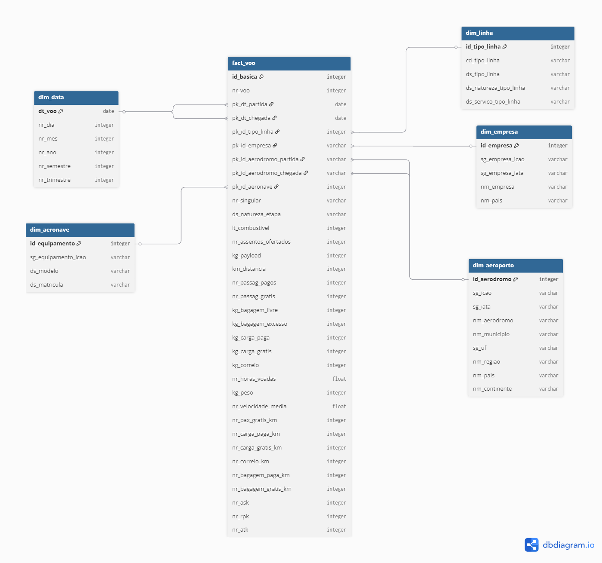

<h1 align="center"> MVP - Pós-Graduação PUC RJ - Sprint 1 </h1>
<h2 align="center">Análise dos Microdados da Agência Nacional de Aviação Civil (Anac) </h2>
<p align="center">Projeto desenvolvido durante a Sprint 1 - Engenharia de Dados da Pós Graduação em Ciência de Dados da PUC Rio. Consiste em uma análise feita em cima da base de microdados disponibilizada pela Agência Nacional de Aviação Civil (Anac)</p>

### Objetivo:
Para este projeto iremos explorar 3 indicadores:
- Quantidade de voos realizado por empresa aérea, por rota e variando por mês, semestre e ano;
- Total de passageiros transportados por empresa aérea, por rota e variando por mês, semestre e ano;
- Quais as rotas com maior custo benefício baseado na relação entre passageiros pagantes e consumo de combustível, variando por mês, semestre e ano;

### Plataforma:
A plataforma utilizada para o desenvolvimento deste projeto foi o [Databricks Free Edition](https://dbc-e2e6cd1f-62ba.cloud.databricks.com/?o=2179636621597322).

### Base de dados:
A Anac disponibiliza arquivos csv com dados de cada voo feito no espaço aéreo brasileiro disponível nesse [link](https://www.gov.br/anac/pt-br/assuntos/regulados/empresas-aereas/Instrucoes-para-a-elaboracao-e-apresentacao-das-demonstracoes-contabeis/descricao-de-variaveis). 
Além dos dados brutos, a Anac também disponibiliza uma descrição detalhada destas variáveis [aqui](https://www.gov.br/anac/pt-br/assuntos/regulados/empresas-aereas/Instrucoes-para-a-elaboracao-e-apresentacao-das-demonstracoes-contabeis/descricao-de-variaveis).
O conjunto de dados se divide entre: etapa básica e etapa combinada. Para este trabalhado, utilizaremos apenas a etapa básica:

> Etapa Básica (flight stage): As etapas básicas são aquelas realizadas pela aeronave desde a sua decolagem até o próximo pouso, independentemente de onde tenha ocorrido o embarque ou o desembarque do objeto de
> transporte. Os dados estatísticos das etapas básicas representam o status da aeronave em cada etapa do voo, apresentando a movimentação de cargas e passageiros entre os aeródromos de origem e destino da aeronave.
> É a operação de uma aeronave entre uma decolagem e o próximo pouso, a ligação entre dois aeródromos.

### Coleta:
Inicialmente, criamos o notebook [01-preparacao](notebooks/01-preparacao.ipynb) para resetar todos os catálogos e criá-los novamente. Criamos o catálogo `mvp`, com os schemas `staging`, `bronze`, `silver` e `gold`.

O notebook [02-download](notebooks/02-download.ipynb) contém os comandos utilizados para baixar os registros e salvar no ambiente do Databricks. Como os dados disponibilizados pela Anac variam desde o ano 2000 até o ano atual, para facilitar a análise, iremos internalizar apenas dados dos últimos cinco anos completos (2020-2024). Inicialmente os arquivos brutos (.zip) são salvos na pasta `/Volumes/mvp/staging/anac/zip/`. Em seguida, o conteúdo dos arquivos .zip é extraído e movido para a pasta `/Volumes/mvp/staging/anac/txt/`.

Coletados os dados, utilizamos alguns comandos Python e Spark para unir as informações de todos os arquivos em uma única tabela. Nesta etapa, percebemos que o arquivo do mês 04 de 2024 tinha uma coluna a menos que o restante dos notebooks. Como não sabemos o motivo desta coluna faltante, esse arquivo foi descartado. Ao final, o dataframe contendo todos os dados foi salvo como uma tabela delta no volume de dados  `mvp.bronze.voos` e todas as colunas foram comentadas. O passo a passo desta etapa se encontra no notebook [03-bronze](notebooks/03-bronze.ipynb). 

### Modelagem:
A fim de melhor entender os dados, copiei as informações disponibilizadas pela ANAC para uma planilha do Google Sheets. A planilha se encontra [neste link](https://docs.google.com/spreadsheets/d/1_4_-XutVG2gyGrHMkfTlin1-UbQRA27tdRVC9ZI0fmk/edit?usp=sharing). Observando os nomes das variáveis do arquivo, identificamos que seria possível dividir as colunas em algumas tabelas e trabalhar com a modelagem dimensãoXfato. Sendo assim, cada variável foi rotulada (utilizando a coluna 'Entidade') como pertencente a alguma entidade ('Voo', 'Aeroporto', 'Aeronave', 'Empresa', 'Linha', 'Data') ou foi descartada (rótulo 'Descartar'). Para as variáveis que foram descartadas, o motivo do descarte se encontra na coluna 'Motivo Descarte'.

Separadas as colunas, utilizei o notebook [modelagem](notebooks/modelagem.ipynb) para entender melhor como os dados se comportavam e buscar estabelecer os critérios de qualidade. As colunas 'Exemplo de valores', 'Tipo', 'LEN(MIN)', 'LEN(MAX)' e 'Critérios de qualidade' da planilha de modelagem traz dados dessa análise. Estabelecidos os critérios de qualidade (descritos na coluna 'Critérios de qualidade'), partimos para realizar os tratamentos e limpeza dos dados. O notebook [04-silver](notebooks/04-silver.ipynb) contém todas as etapas de processamento. A tabela `mvp.silver.voos_tipado` é o resultado final desta etapa.

Por fim, separamos a tabela `voos_tipado` em cinco dimensões (Dimensão Tempo, Dimensão Aeronave, Dimensão Empresa, Dimensão Aeroporto e Dimensão Linha) e uma tabela fato (Fato Voo). Essas tabelas foram salvas em `mvp.gold`. Com o intuito de minizar erros ao agrupar os valores das tabelas dimensões, optamos criar uma função `moda_por_coluna`, que aplicaria o conceito de moda em cada agrupamento. Assim, caso um aeroporto de id 1, fosse assinalado com o nome "Aeroporto X" por 10 registros, e como "Aeroporto Y" por apenas um registro, a informação "Aeroporto X" seria a escolhida para ocupar a coluna nome. Este tratamento não impede 100% dos erros, mas pelo menos, traz mais segurança para as nossas análises, evitando duplicidade de informações. O processo de conversão da tabela `voos_tipado` nas cinco dimensões pode ser acompanhado no notebook [05-gold](notebooks/05-gold.ipynb). Veja um exemplo a seguir da função moda e da separação de uma das tabelas dimensão:

```python
from pyspark.sql import functions as F
from pyspark.sql import Window

def moda_por_coluna(df, chave, coluna):
    w = Window.partitionBy(chave).orderBy(F.desc("count"))
    
    return (
        df.groupBy(chave, coluna)
          .count()
          .withColumn("rn", F.row_number().over(w))
          .filter("rn = 1")
          .select(chave, coluna)
    )
```

```python
# dim_aeroporto
print("dim_aeroporto:")
aeroportos = df.select([
    F.col("id_aerodromo_destino").alias("id_aerodromo"),
    F.col("nm_aerodromo_destino").alias("nm_aerodromo"),
    F.col("nm_continente_destino").alias("nm_continente"),
    F.col("nm_municipio_destino").alias("nm_municipio"),
    F.col("nm_pais_destino").alias("nm_pais"),
    F.col("nm_regiao_destino").alias("nm_regiao"),
    F.col("sg_iata_destino").alias("sg_iata"),
    F.col("sg_icao_destino").alias("sg_icao"),
    F.col("sg_uf_destino").alias("sg_uf")
]).union(df.select([
    F.col("id_aerodromo_origem").alias("id_aerodromo"),
    F.col("nm_aerodromo_origem").alias("nm_aerodromo"),
    F.col("nm_continente_origem").alias("nm_continente"),
    F.col("nm_municipio_origem").alias("nm_municipio"),
    F.col("nm_pais_origem").alias("nm_pais"),
    F.col("nm_regiao_origem").alias("nm_regiao"),
    F.col("sg_iata_origem").alias("sg_iata"),
    F.col("sg_icao_origem").alias("sg_icao"),
    F.col("sg_uf_origem").alias("sg_uf")
]))
column_id = "id_aerodromo"
colunas = [
    "nm_aerodromo",
    "nm_continente",
    "nm_municipio",
    "nm_pais",
    "nm_regiao",
    "sg_iata",
    "sg_icao",
    "sg_uf"
]
dim_aeroporto = None

for col in colunas:
    moda_df = moda_por_coluna(aeroportos, column_id, col)
    dim_aeroporto = moda_df if dim_aeroporto is None else dim_aeroporto.join(moda_df, column_id, "left")

print("IDs repetidos:", dim_aeroporto.groupBy(column_id).count().where("count > 1").count())
dim_aeroporto.limit(5).display()
```

Por fim, temos o seguinte modelo de dados salvo no schema mvp.gold:


### Análises:
Agora precisamos responder aos 3 objetivos iniciais:
1. Quantidade de voos realizado por empresa aérea, por rota e variando por mês, semestre e ano;
2. Total de passageiros transportados por empresa aérea, por rota e variando por mês, semestre e ano;
3. Quais as rotas com maior custo benefício baseado na relação entre passageiros pagantes e consumo de combustível, variando por mês, semestre e ano;

O notebook [06-analises](notebooks/06-analises.ipynb) traz as respostas para esses objetivos. Para compreender é melhor essa análise e o desenvolvimento deste projeto, sugiro assistir o vídeo a seguir que gravei. Nele é possível validar melhor as respostas para os 3 objetivos iniciais:
- [Projeto Final - Pós Graduação PUC Rio](https://youtu.be/ibde4zwR3QQ)

### Conclusão e autoavaliação:
Realizar este trabalho foi bastante desafiador. Já tinha experiência de trabalhar com Python e PySpark pois são ferramentas que utilizo no dia a dia de trabalho. No entanto, lá, fico refém e delimitado ao ambiente da organização. Nunca tinha tido a experiência de trabalhar da minha própria máquina e utilizando dataframes externos. Ter conhecido o databricks vai me ajudar bastante nas próximas etapas da carreira.

Outra etapa desafiadora do projeto foi a modelagem dimensão-fato. Sempre trabalhei com tabelas flat, mas nesse projeto quis me desafiar a modelar um esquema estrela. Foi bastante desafiador no começo, mas com a ajuda dos colegas, professores e do amigo Copilot, consegui encontrar maneiras eficientes de resolver meus problemas. O que mais me impressionou foi a utilização da função moda para garantir um agrupamento das informações de maneira mais eficiente e pertinente.

Um ponto que gostaria de ter implementado, mas não consegui pela questão do prazo, foi a visualização desses dados em um dashboard do Power BI. Mas em breve, pretendo fazer essa melhoria e subir como uma versão 2.0.

Por fim, agradeço a todos os professores e estudantes. Com a ajuda de vocês chego ao final da Sprint com o sentimento de dever cumprido e muito feliz com o resultado.

Um forte abraço! Vlw!

